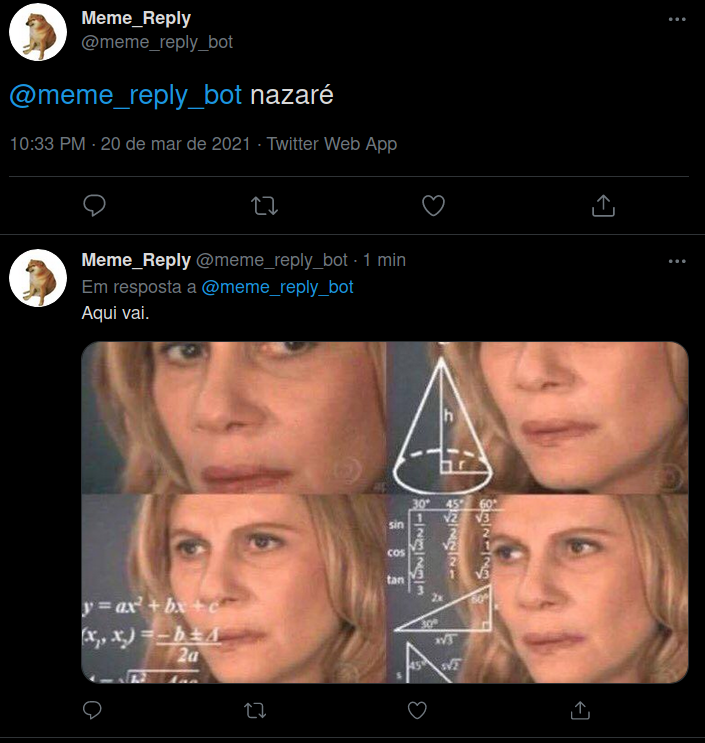

# Twitter Bot Meme Reply

Esse projeto tem o  objetivo de criar um bot do twitter para enviar aos usuários a imagem/reaction do meme desejado.
---
##Esse trabalho teve como base:  
[realpython twitter bot python tweepy](https://realpython.com/twitter-bot-python-tweepy/)
---
## Imagem:  

---
## Rodando o aplicativo  
Crie um arquivo `.env` com as variaveis de ambiente requisitadas da API(key e tokens) do Twitter.  
```bash
$ python memereply.py
```
---
## Site Twitter:  
[https://twitter.com/meme_reply_bot](https://twitter.com/meme_reply_bot)